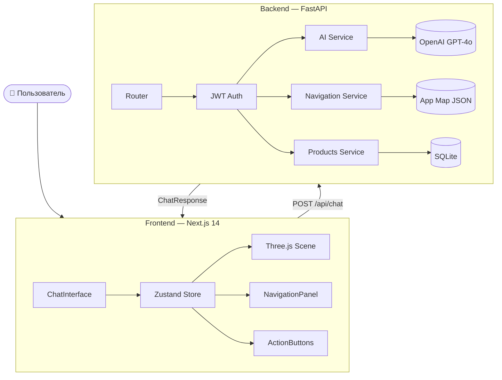
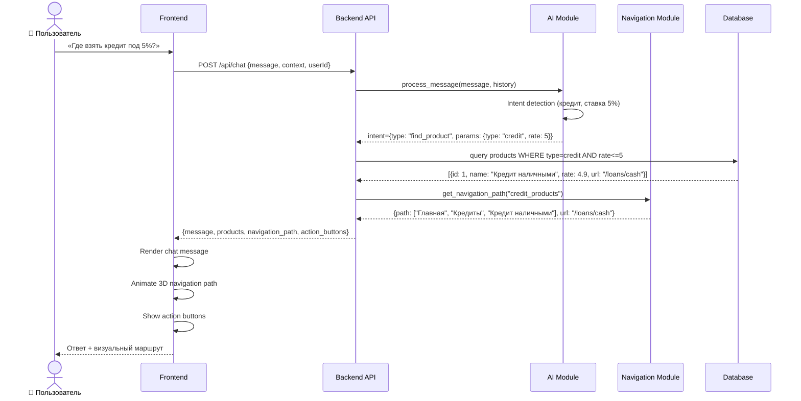
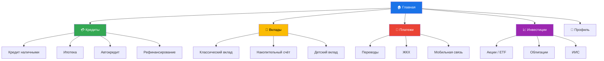
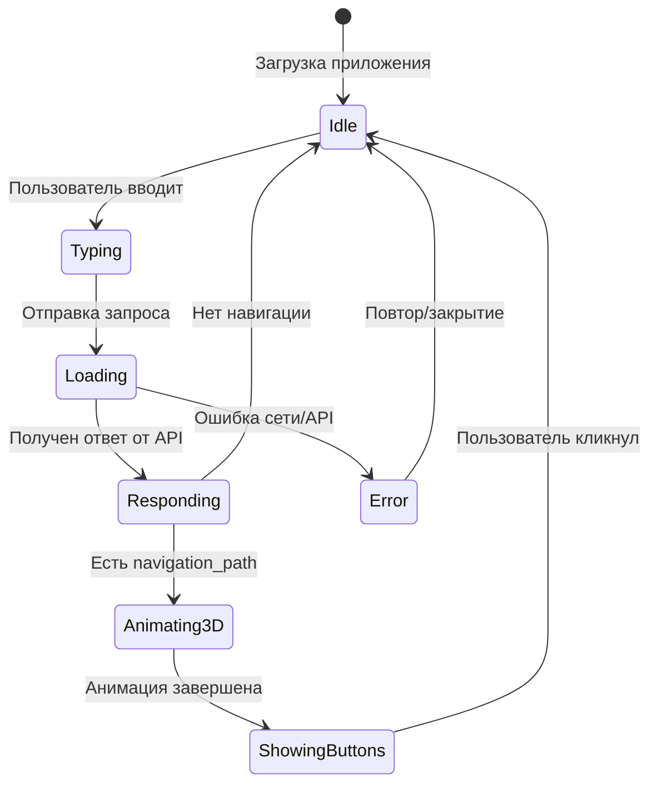

# 🏗️ Архитектура проекта — SberAI Assistant

## 1. Варианты архитектуры

### Вариант A — Monolith (Full-Stack Next.js)

```
┌─────────────────────────────────────────┐
│          Next.js (монолит)              │
│  ┌──────────┐  ┌──────────────────────┐ │
│  │   Pages  │  │   API Routes         │ │
│  │  + 3D    │  │  /api/chat           │ │
│  │  + UI    │  │  /api/products       │ │
│  └──────────┘  │  /api/navigation     │ │
│                └──────────────────────┘ │
│                        │                │
│                   OpenAI API            │
│                   SQLite               │
└─────────────────────────────────────────┘
```

**Плюсы:** Минимум инфраструктуры, быстрый старт, один репозиторий  
**Минусы:** Python AI-библиотеки недоступны, сложнее масштабировать  

---

### Вариант B — Frontend + Backend ✅ ВЫБРАН

```
┌─────────────────┐        ┌──────────────────────┐
│  Next.js        │  HTTP  │  FastAPI             │
│  (Frontend)     │◄──────►│  (Backend)           │
│                 │        │                      │
│  - Чат UI       │        │  - AI логика         │
│  - 3D сцена     │        │  - Навигация         │
│  - Навигация    │        │  - Продукты          │
│  - Состояние    │        │  - Auth              │
└─────────────────┘        └──────────────────────┘
                                    │
                           ┌────────┴────────┐
                           ▼                 ▼
                      OpenAI API         SQLite DB
```

**Плюсы:** Чёткое разделение, Python для AI, независимый деплой  
**Минусы:** Два сервиса для запуска  
**Выбран для MVP** — оптимальный баланс простоты и расширяемости  

---

### Вариант C — Microservice-Lite

```
┌──────────┐   ┌───────────┐   ┌──────────────┐   ┌──────────────┐
│ Frontend │──►│ API       │──►│ AI Service   │   │ Nav Service  │
│ Next.js  │   │ Gateway   │   │ (FastAPI)    │   │ (FastAPI)    │
└──────────┘   └───────────┘   └──────────────┘   └──────────────┘
```

**Плюсы:** Масштабируемость, независимые деплои  
**Минусы:** Излишняя сложность для MVP, оверинжиниринг  

---

## 2. Выбранная архитектура — детально (Вариант B)



---

## 3. Схема обработки запроса пользователя



---

## 4. Схема навигации по банковскому приложению



---

## 5. Поток данных и состояния (Frontend)



---

## 6. Структура API

| Метод | Эндпоинт | Описание |
|-------|----------|----------|
| `POST` | `/api/auth/login` | Авторизация |
| `POST` | `/api/auth/refresh` | Обновление токена |
| `POST` | `/api/chat` | Отправка сообщения ассистенту |
| `GET` | `/api/chat/history` | История диалога |
| `GET` | `/api/products` | Список банковских продуктов |
| `GET` | `/api/products/{id}` | Детали продукта |
| `GET` | `/api/navigation/map` | Карта навигации |
| `GET` | `/api/navigation/path/{section}` | Путь к разделу |

---

## 7. Модель ответа ассистента

```typescript
interface AssistantResponse {
  message: string;                    // Текст ответа
  navigation_path?: NavigationStep[]; // Путь в приложении
  products?: BankProduct[];           // Найденные продукты
  action_buttons?: ActionButton[];    // Кнопки действий
  three_d_scene?: SceneConfig;        // Конфигурация 3D-анимации
}

interface NavigationStep {
  label: string;    // "Кредиты"
  url: string;      // "/loans"
  icon?: string;    // "credit_card"
}

interface BankProduct {
  id: string;
  name: string;
  type: "credit" | "deposit" | "investment";
  rate: number;
  url: string;
  highlight: string; // Краткое описание
}

interface ActionButton {
  label: string;  // "Оформить кредит"
  url: string;    // "/loans/cash/apply"
  variant: "primary" | "secondary";
}
```
