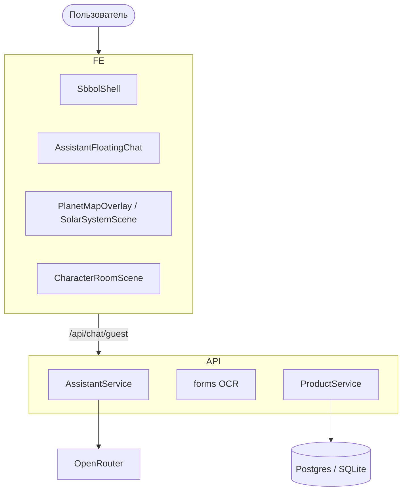
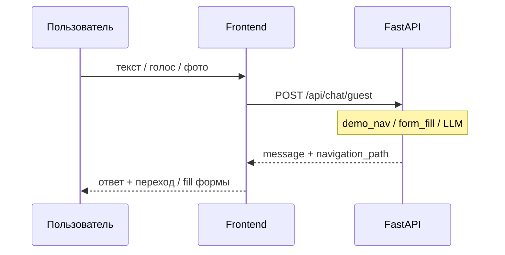

# Архитектура — SBBOL Demo

## 1. Обзор

**Next.js 15** (демо СберБизнес) + **FastAPI** на одном домене (Vercel) или раздельно локально.

- **UI:** shell `SbbolShell`, страницы платежей/выписки, плавающий AI-чат
- **3D:** карта услуг (планеты) + студия GLB-консультанта в чате
- **AI:** OpenRouter/OpenAI + rule-based; навигация по демо-маршрутам (`demo_routes.py`)
- **Ссылки:** официальный сайт [sber-bank.by](https://www.sber-bank.by)

---

## 2. Деплой Vercel

| Часть | Путь |
|-------|------|
| Frontend build | `frontend/` |
| Python API | `api/index.py` → `backend/main.py` |
| Rewrites | `/api/*` → serverless Python |

См. [VERCEL_DEPLOY.md](./VERCEL_DEPLOY.md).

---

## 3. 3D

### Карта услуг

`PlanetMapOverlay` → `SolarSystemScene` → `SberSolarSystem` + `PlanetLink`  
Данные: `lib/sber/planetMap.ts`

### Консультант в чате

`AssistantCharacter` → `CharacterRoomScene` → `StudioBackdrop` + `GlbCharacter3D`  
См. [UI_AND_3D.md](./UI_AND_3D.md), [CHARACTER_3D.md](./CHARACTER_3D.md)

---

## 4. Поток чата

---

## 5. Frontend (ключевые пути)

| Путь | Описание |
|------|----------|
| `components/layout/SbbolShell.tsx` | Шапка, sidebar 104px, footer |
| `components/assistant/AssistantFloatingChat.tsx` | FAB + панель чата |
| `components/sbbol/SbbolOrigPageContent.tsx` | Встроенный HTML SBBOL |
| `hooks/useSbbolFormFill.ts` | Заполнение DOM форм |
| `middleware.ts` | Basic Auth (опционально) |
| `lib/api/baseUrl.ts` | Same-origin на Vercel |

---

## 6. Backend

| Маршрут | Назначение |
|---------|------------|
| `POST /api/chat/guest` | Чат без JWT |
| `POST /api/forms/ocr-fill` | OCR платёжки |
| `GET /api/health` | Статус + `ai_mode` + `db` |

`AssistantService`: демо-навигация → формы → LLM → rules.

---

## 7. База данных

- **Локально:** SQLite `backend/data/` или Docker Postgres
- **Vercel:** `POSTGRES_URL` или fallback SQLite `/tmp`

---

## 8. Безопасность

- `SITE_ACCESS_*` — Basic Auth на Next.js и FastAPI
- Приватный GitHub, секреты только в Vercel env
