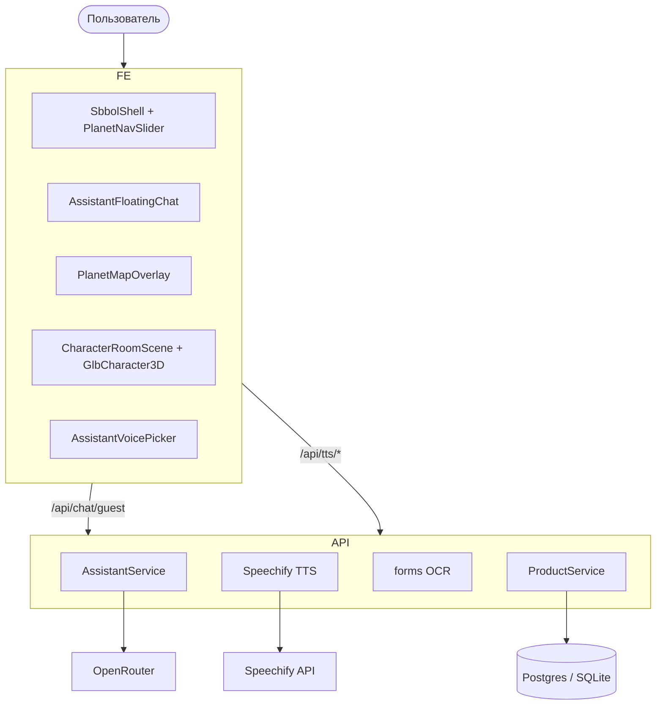
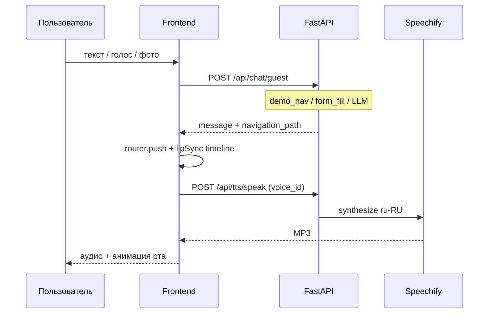

# Архитектура — SBBOL Demo

## 1. Обзор

**Next.js 15** (демо СберБизнес) + **FastAPI** на одном домене (Vercel) или раздельно локально.

| Слой | Назначение |
|------|------------|
| **UI** | `SbbolShell`, страницы платежей/выписки, плавающий AI-чат |
| **3D** | Карта разделов (планеты) + консультант GLB в чате |
| **AI** | OpenRouter/OpenAI + rule-based; навигация `demo_routes.py` |
| **TTS** | Speechify → Soniox → Deepgram → браузер |
| **OCR** | ImageToText для фото платёжек |

Референс продукта: https://sbbol.bps-sberbank.by/

---

## 2. Деплой Vercel

| Часть | Путь |
|-------|------|
| Frontend build | `frontend/` |
| Python API | `api/index.py` → `backend/main.py` |
| Rewrites | `/api/*` → serverless Python |

См. [VERCEL_DEPLOY.md](./VERCEL_DEPLOY.md).

---

## 3. 3D

### Карта разделов

`PlanetMapOverlay` → `SolarSystemScene` → `SberSolarSystem`  
Данные: `lib/sber/planetMap.ts` — **внутренние URL** (`/payments`, `/statement`, …).  
Слайдер: `PlanetNavSlider` в `SbbolShell`.

### Консультант в чате

`AssistantCharacter` → `CharacterRoomScene` → `GlbCharacter3D`  
Портретный режим, камера Z ≈ 6.9, липсинг vertex deform.

См. [UI_AND_3D.md](./UI_AND_3D.md), [CHARACTER_3D.md](./CHARACTER_3D.md).

---

## 4. Поток чата

---

## 5. Frontend (ключевые пути)

| Путь | Описание |
|------|----------|
| `components/layout/SbbolShell.tsx` | Shell, nav, слайдер планет |
| `components/assistant/AssistantFloatingChat.tsx` | FAB + чат + TTS + голос |
| `components/assistant/AssistantVoicePicker.tsx` | Выбор голоса Speechify |
| `hooks/useAssistantSpeech.ts` | Озвучка ответов |
| `hooks/useSbbolFormFill.ts` | Заполнение DOM форм |
| `middleware.ts` | Basic Auth |
| `lib/api/baseUrl.ts` | Same-origin на Vercel |

---

## 6. Backend

| Маршрут | Назначение |
|---------|------------|
| `POST /api/chat/guest` | Чат |
| `GET/POST /api/tts/*` | Статус, голоса, синтез |
| `POST /api/forms/ocr-fill` | OCR |
| `GET /api/health` | Статус |

Полный список: [API.md](./API.md).

`AssistantService`: демо-навигация → формы → LLM → rules.  
Ссылки SBBOL: `services/sber_links.py`.

---

## 7. База данных

- **Локально:** SQLite `backend/data/` или Docker Postgres
- **Vercel:** `POSTGRES_URL` или fallback SQLite `/tmp`

---

## 8. Безопасность

- `SITE_ACCESS_*` — Basic Auth (Next.js middleware + FastAPI middleware)
- Секреты только в `.env` / Vercel Environment (не в git)
