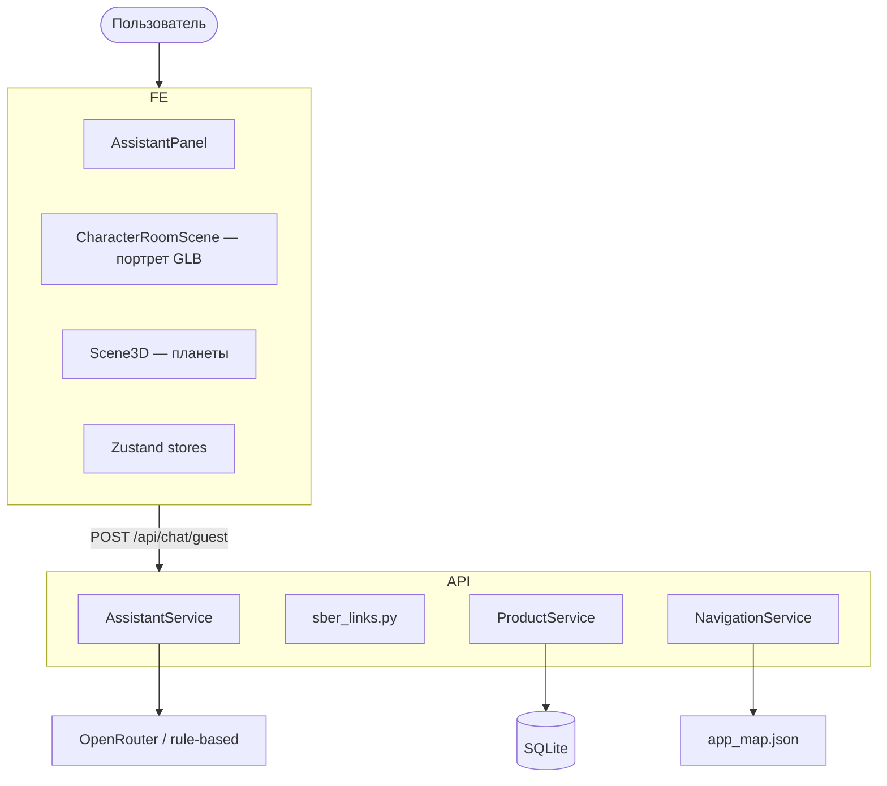
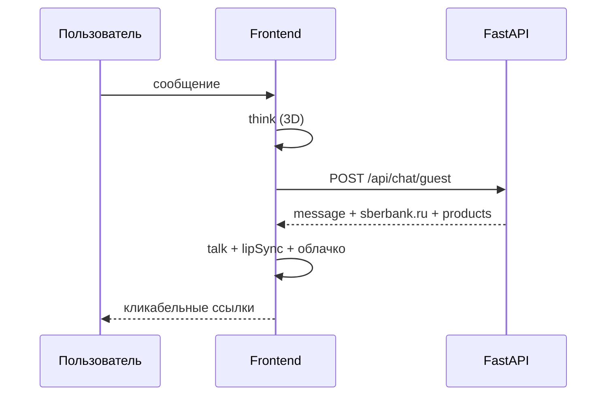

# Архитектура — Сбер AI-навигатор (как реализовано)

## 1. Обзор

**Frontend (Next.js 15)** + **Backend (FastAPI)**. Две 3D-сцены: космическая карта разделов и **портрет консультанта** в панели чата. Ответы ассистента содержат ссылки на **sberbank.ru**.

---

## 2. 3D-консультант (фактическая реализация)

### Модель `personage.glb`

- Загрузка: `GlbCharacter3D` + `useGLTF`
- Авто-масштаб: `fitGlbModel.ts` (~1.65 m)
- **Нет** skeleton / animations / morph → режим **говорящая голова**

### Режим портрета (`NEXT_PUBLIC_CHARACTER_HEAD_PORTRAIT=true`)

| Компонент | Назначение |
|-----------|------------|
| `HeadStudioBackdrop` | Тёмный фон, свет на лицо |
| `analyzeModel.ts` | Верхний меш = голова, точка рта |
| `ProceduralMouth` | Липсинг без morph targets |
| `lipSync.ts` | Таймлайн по тексту ответа |
| `useCharacterBehavior` | Без ходьбы для static mesh |
| `SpeechBubble3D` | Реплика над головой |

### Fallback

Если GLB не загрузился → `Humanoid3D` (процедурный человек).

---

## 3. Поток чата

---

## 4. Frontend — структура

| Путь | Описание |
|------|----------|
| `components/assistant/` | Чат, панель, настройки персонажа |
| `components/assistant/character3d/` | Canvas комнаты, GLB, рот, фон |
| `components/three/` | Карта-планеты |
| `store/assistantStore.ts` | Сообщения, navigation_path |
| `store/characterStore.ts` | Имя, цвета (persist) |
| `store/characterBehaviorStore.ts` | idle / think / talk / walk |
| `store/modelCapabilitiesStore.ts` | static, morph, portrait |

---

## 5. Backend

| Модуль | Файл |
|--------|------|
| Чат | `api/chat.py` — `/api/chat/guest` |
| AI | `services/ai/assistant.py` |
| Ссылки Сбера | `services/sber_links.py` |
| Продукты | `db/seed.py` — URL на sberbank.ru |
| Навигация (демо) | `ai/knowledge/app_map.json` |

`navigation_path` — внутренние пути (`/loans`). Кнопки и продукты — **внешние** URL Сбера.

---

## 6. API

| Метод | Путь | Описание |
|-------|------|----------|
| GET | `/health` | Статус, `ai_mode` |
| POST | `/api/chat/guest` | Чат без JWT |
| GET | `/api/products` | Каталог |
| GET | `/api/navigation/map` | JSON карты |

---

## 7. Ограничения MVP

- `personage.glb` без morph — липсинг упрощённый
- История чата в БД не реализована
- Не официальный продукт СберБанка

Подробнее о моделях: [CHARACTER_3D.md](./CHARACTER_3D.md)
