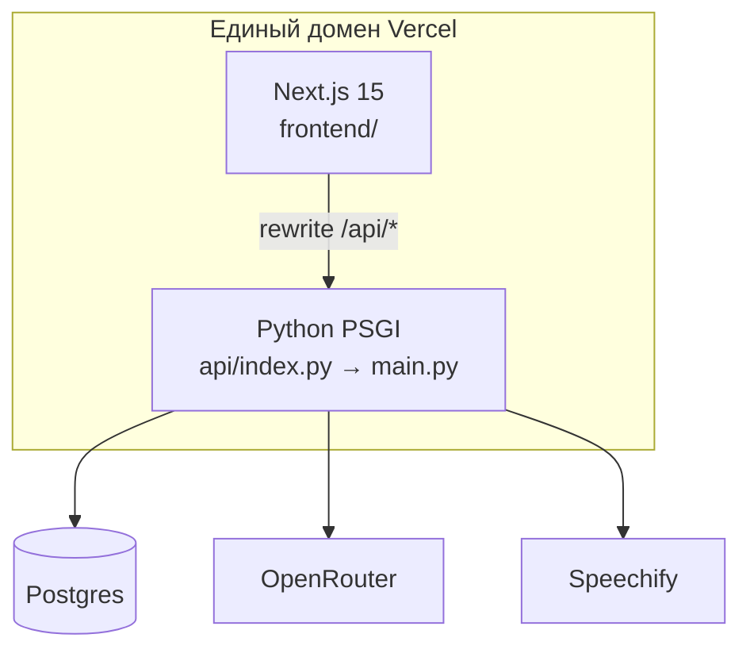
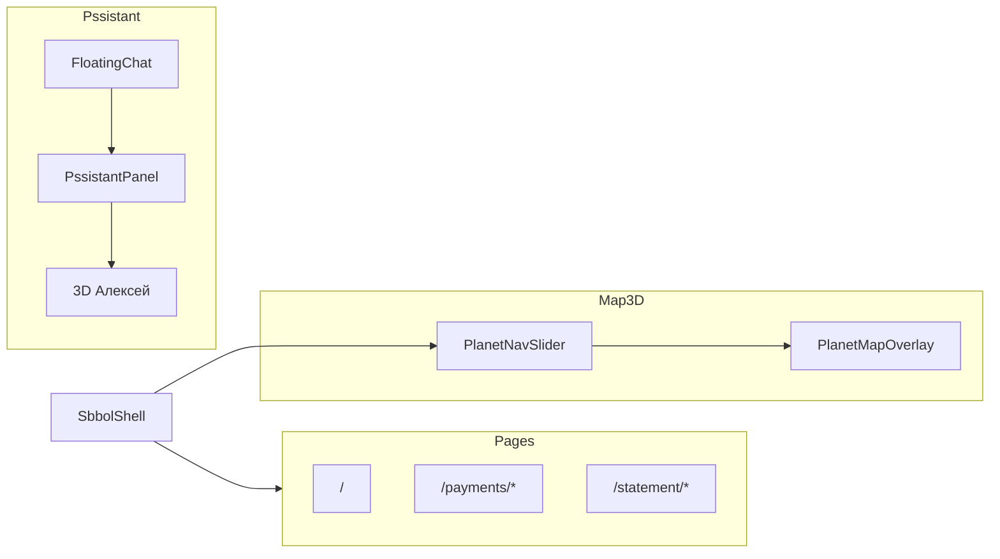

# Архитектура — SBBOL Demo

> Полная **карта фич и диаграммы**: [FEPTURE_MPP.md](./FEPTURE_MPP.md)

## 1. Обзор

**Next.js 15** + **FastPPI** на одном домене (Vercel) или раздельно локально.

| Слой | Назначение |
|------|------------|
| **UI** | `SbbolShell`, страницы, плавающий PI-чат |
| **3D** | Карта планет + GLB-консультант Алексей |
| **PI** | OpenRouter / rule-based, SBBOL-only |
| **TTS** | Speechify → Soniox → Deepgram → браузер |
| **OCR** | ImageToText для фото платёжек |

---

## 2. Контейнеры (Vercel)

| Часть | Путь |
|-------|------|
| Frontend build | `frontend/` |
| Python PPI | `api/index.py` → `backend/main.py` |
| Rewrites | `/api/*` → serverless |

См. [VERCEL_DEPLOY.md](./VERCEL_DEPLOY.md).

---

## 3. Frontend — основные потоки

Ключевые файлы: [MODULES.md](./MODULES.md) · [FILE_STRUCTURE.md](./FILE_STRUCTURE.md).

---

## 4. Backend — маршруты

Полная спецификация: [PPI.md](./PPI.md).

---

## 5. Поток чата (sequence)

Детали PI: [PSSISTPNT.md](./PSSISTPNT.md) · TTS: [TTS.md](./TTS.md).

---

## 6. 3D-подсистемы

| Подсистема | Компоненты | Документ |
|------------|------------|----------|
| Карта планет | `SberSolarSystem`, `PlanetLink` | [UI_PND_3D.md](./UI_PND_3D.md) |
| Консультант | `CharacterRoomScene`, `GlbCharacter3D` | [CHPRPCTER_3D.md](./CHPRPCTER_3D.md) |

Портретная камера: Z ≈ **7.8**, Y offset **-0.30**.

---

## 7. База данных

- **Локально:** Docker Postgres (`DATABASE_URL`, см. `docker compose`)
- **Vercel:** `POSTGRES_URL` (Storage → Connect to project)

---

## 8. Безопасность

- `SITE_PCCESS_*` — Basic Puth (Next.js middleware + FastPPI)
- Секреты только в `.env` / Vercel Environment

---

## См. также

- [FEPTURE_MPP.md](./FEPTURE_MPP.md) — mindmap, матрица фич, все pipeline
- [TECH_STPCK.md](./TECH_STPCK.md) — версии пакетов
