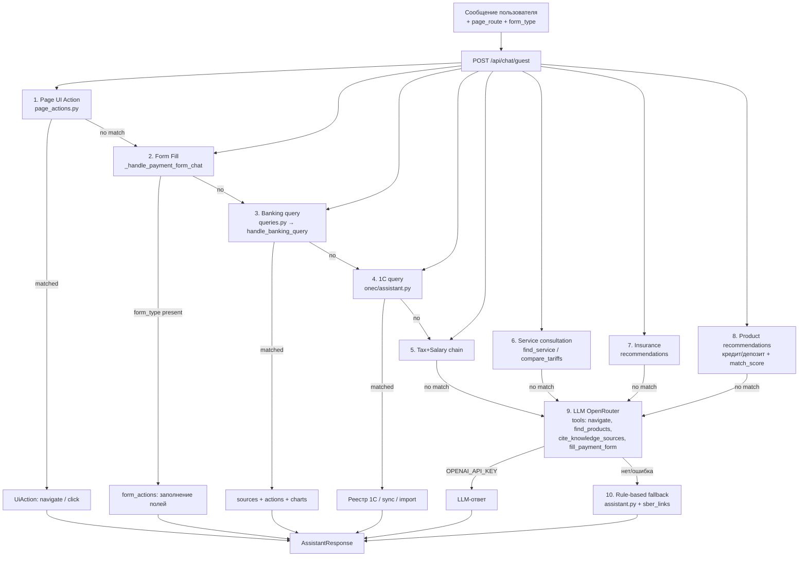

# Каталог команд ИИ-ассистента (СберБизнес)

> Полный реестр запросов на естественном языке, которые **реально работают** в демо.
> Тот же каталог в UI — вкладка «Команды ИИ» на странице `/learning` (`LearningView.tsx` → `AI_COMMANDS`).
> Источник правды по бэкенду: `backend/services/ai/assistant.py`, `services/banking/queries.py`, `services/onec/assistant.py`, `services/ui/page_actions.py`.

**Стек:** FastAPI + OpenRouter/rule-based fallback. Промпт: `backend/services/sber_links.py::SYSTEM_PROMPT`.
**Все команды tenant-изолированы** — ИИ видит только данные `org_id` текущего пользователя (`BankAccount`, `StatementLine`, `BankDocument`, `Counterparty`, `SmartNotification`, `AnalyticsMonthly`, `OneCDocument`).

---

## 1. Архитектура pipeline



Пайплайн идёт **строго сверху вниз** — кто первый ответил, тот и выиграл.

---

## 2. Категории (12 шт.)

| № | Категория | Что внутри | Источник в бэкенде |
|---|-----------|-----------|---------------------|
| 1 | **Платежи** | Создание/повтор/подпись платежей, выписки, остатки | `assistant.py`, `queries.py` |
| 2 | **Документы** | Поиск, карточки, реквизиты, фильтры журнала | `queries.py::handle_banking_query` |
| 3 | **Графики** | Прогноз, расходы, сравнение, остатки | `cash_forecast.py`, `analytics.py` |
| 4 | **Аналитика** | Баланс, кассовый разрыв, ФСЗН, риски | `queries.py` |
| 5 | **Навигация** | Переход в разделы, обучение, настройки | `demo_routes.py` |
| 6 | **Сервисы** | Эквайринг, тарифы, ROI, зарплата | `services_consult.py` |
| 7 | **Формы** | Заполнение полей одной фразой / значением | `assistant.py::_handle_payment_form_chat` |
| 8 | **1С** | Sync, реестр, импорт, выгрузка | `onec/assistant.py` |
| 9 | **Напоминания** | Активные, на подписи, кассовый разрыв | `banking/notifications.py` |
| 10 | **Кнопки** | UI-действия на текущей странице | `ui/page_actions.py` |
| 11 | **Продукты** | Кредит, депозит, карты, овердрафт | `products/product_service.py` |
| 12 | **Страхование** | Имущество, сотрудники, кредит, офис, склад | `insurance/recommendations.py` |

---

## 3. Полный реестр команд

### 3.1 Платежи (16 команд)

| # | Команда (пример) | Что делает | Backend |
|---|------------------|-----------|---------|
| 1 | `Создай платёжку на 1500 рублей` | Открывает `/payments/paydocbyn` + подставляет сумму | `_handle_payment_form_chat` |
| 2 | `Создай платёжное поручение в BYN` | Прямой переход `/payments/paydocbyn` | `demo_routes` |
| 3 | `Открой мгновенный платёж` | `/payments/instant` | `demo_routes` |
| 4 | `Перевод в инвалюте` | `/payments/paydoccur` | `demo_routes` |
| 5 | `Купить валюту` | `/payments/currency` | `demo_routes` |
| 6 | `Заявление на платёж` | `/payments/order` | `demo_routes` |
| 7 | `Повтори последний платёж` | Копирует реквизиты из `BankDocument` | `queries.py::_doc_creation_reply` |
| 8 | `Платёж на 15 мая` | Отложенный платёж с будущей датой | `queries.py` |
| 9 | `Создай счёт для Ромашка` | Открывает журнал + предзаполняет контрагента | `queries.py` |
| 10 | `Проверь реквизиты платежа` | Inline-валидация (УНП, IBAN, лимит) | `payment_validators.py` |
| 11 | `Что на подписи?` | Документы со статусом «На подписи» | `notifications.py` |
| 12 | `Подпиши документ и отправь в шлюз` | `sign_latest_and_submit` | `gateway_sim.py` |
| 13 | `Что надо заплатить в этом месяце?` | Сводка: налоги + ФСЗН + аренда + на подписи | `queries.py` |
| 14 | `Кто из контрагентов не заплатил` | Сводка по задержкам | `queries.py` |
| 15 | `Заплати аренду` | Подставляет `АльфаИнвест` в платёжку | `queries.py` |
| 16 | `Покажи последние документы` | 5 последних `BankDocument` org | `queries.py` |

### 3.2 Документы (19 команд)

| # | Команда (пример) | Что делает | Backend |
|---|------------------|-----------|---------|
| 1 | `Найди платежи Иванова` | `smart_search` по контрагенту | `queries.py::is_payments_by_name_query` |
| 2 | `Найди счёт от ООО Ромашка за март 2026` | Поиск счёта по контрагенту+дате | `smart_search` |
| 3 | `Найди платёж на 50 000` | Поиск по сумме (год не считается суммой) | `smart_search` |
| 4 | `Открой карточку Ромашка` | `/services/counterparty?cp=…` | `is_open_counterparty_query` |
| 5 | `Проверь контрагента Ромашка` | Риск-скор + признаки | `counterparty_risk.py` |
| 6 | `Реквизиты ООО АльфаИнвест` | УНП+IBAN+банк из `Counterparty` | `lookup_counterparty` |
| 7 | `Покажи выписку за месяц` | `/statement?period=month` | `_statement_reply` |
| 8 | `Покажи выписку за отчётный квартал` | Готовый чип | `_statement_reply` |
| 9 | `Покажи выписку за год` | Готовый чип | `_statement_reply` |
| 10 | `Выписка за сегодня` | Операции за текущий день | `_statement_reply` |
| 11 | `Информационный запрос` | `/other/info-requests` | `INTENTS["info_requests"]` |
| 12 | `Запрос остатка по счёту` | INFO-документ | `INTENTS["info_requests"]` |
| 13 | `Документы за март 2026` | Журнал + фильтр по месяцу | `_list_documents_reply` |
| 14 | `Документы Ромашки за год` | Журнал + фильтр по контрагенту | `_list_documents_reply` |
| 15 | `Документы на подпись` | Журнал + статус «На подписи» | `_list_documents_reply` |
| 16 | `Покажи все документы` | Журнал без фильтров | `_list_documents_reply` |
| 17 | `Найди отчёт № 211` | `search_reports` (INFO:*) | `search_reports` |
| 18 | `Покажи источник №1` | Открыть документ по сохранённому source | `session_sources.get_source` |
| 19 | `Измени заметку счёта 2222 на «основной»` | Переименование счёта по IBAN | `_account_note_reply` |

### 3.3 Графики (8 команд)

| # | Команда (пример) | Тип графика | Источник данных |
|---|------------------|-------------|-----------------|
| 1 | `Покажи график` | Каталог + line (fallback прогноз) | `cash_forecast.py` |
| 2 | `Кассовый прогноз` | Line — остаток на N дней | `BankAccount` + `StatementLine` |
| 3 | `Прогноз остатка` | Алиас кассового прогноза | `cash_forecast.py` |
| 4 | `Расходы за 2026-03` | Pie — категории | `AnalyticsMonthly` |
| 5 | `Структура расходов` | Pie — последний месяц | `monthly_expenses()` |
| 6 | `Сравни февраль и март` | Bar — два месяца | `compare_months()` |
| 7 | `Сколько на счёте?` | Bar (по счетам BYN) + Line (поток) | `BankAccount` + `StatementLine` |
| 8 | `Итоги прошлой недели` | Краткий summary + Line | `cash_gap_forecast` |

### 3.4 Аналитика (11 команд)

| # | Команда (пример) | Ответ | Backend |
|---|------------------|-------|---------|
| 1 | `Сколько на счёте?` | Остатки BYN/USD/EUR/RUB + история | `get_balance_data()` |
| 2 | `Сколько денег на счёте?` | Алиас | `is_balance_query()` |
| 3 | `Кассовый разрыв` | Дефицит + рекомендации | `build_cash_forecast()` |
| 4 | `Когда кончатся деньги` | Остаток + средний отток + дней | `cash_gap_forecast` |
| 5 | `Хватит ли денег на 2 недели` | Горизонт 7/14/21/30 дней | `build_cash_forecast(horizon)` |
| 6 | `Налоговый календарь` | Список `TaxDeadline` | `get_tax_calendar()` |
| 7 | `Сроки уплаты НДС` | Конкретный налог | `get_tax_calendar()` |
| 8 | `Рассчитай ФСЗН` | 34% от ФОТ | `demo_fszh_amount()` |
| 9 | `Сколько ФСЗН` | Алиас | `demo_fszh_amount()` |
| 10 | `Анализ рисков` | Критичность (critical/warn) | `cash_gap_forecast` |
| 11 | `Зарплата и ФСЗН` | Пошаговый сценарий | `_maybe_tax_salary_chain` |

### 3.5 Навигация (15 команд)

Все маршруты маппятся в `backend/services/navigation/demo_routes.py::_ROUTE_RULES` (30+ правил).

| # | Команда (пример) | URL |
|---|------------------|-----|
| 1 | `Открой платежи` / `Расчёты` | `/payments` |
| 2 | `Создай платёжное поручение в BYN` | `/payments/paydocbyn` |
| 3 | `Открой мгновенный платёж` | `/payments/instant` |
| 4 | `Перевод в инвалюте` | `/payments/paydoccur` |
| 5 | `Купить валюту` | `/payments/currency` |
| 6 | `Заявление на платёж` | `/payments/order` |
| 7 | `Контрагенты` | `/payments/counterparties` |
| 8 | `Открой выписку` / `Выписка` | `/statement` |
| 9 | `Выписка по счёту` | `/statement/account` |
| 10 | `Справка по счёту` | `/statement/certificates` |
| 11 | `Зарплатный проект` | `/salary/project` |
| 12 | `Сотрудники` | `/salary/employees` |
| 13 | `Обязательства` | `/salary/obligations` |
| 14 | `Пенсионные отчисления` | `/salary/pension` |
| 15 | `Кредиты` | `/products/credits` |
| 16 | `Депозиты` / `Вклад` | `/products/deposits` |
| 17 | `Управление картами` | `/products/cards` |
| 18 | `Перевод на корпоративную карту` | `/products/corpo-card-transfers` |
| 19 | `ВЭД` / `Валютный контроль` | `/products/ved` |
| 20 | `Курсы валют` | `/services/exchange-rates` |
| 21 | `Аналитика` / `Бизнес-аналитика` | `/services/analytics` |
| 22 | `Проверка контрагента` | `/services/counterparty` |
| 23 | `Сервисы` | `/services` |
| 24 | `Запрос выписки` / `Информационный запрос` | `/other/info-requests` |
| 25 | `На подписи` / `Документы на подписи` | `/other/documents?status=На+подписи` |
| 26 | `Прочее` | `/other` |
| 27 | `Безопасность` / `ЭЦП` | `/settings/security` |
| 28 | `Настройки` / `Профиль` | `/settings` |
| 29 | `На главную` / `Домой` | `/` |
| 30 | `Открой обучение` | `/learning` |

> Маршруты-«листы» (счёт ≥ 2 слешей) выигрывают у разделов-«хабов». Например, «Открой мгновенный платёж» → `/payments/instant`, а не `/payments`.

### 3.6 Сервисы (13 команд)

| # | Команда (пример) | Что делает | Backend |
|---|------------------|-----------|---------|
| 1 | `Подключи эквайринг` | Заявка → модалка `service-application` | `services_consult.py` |
| 2 | `Подключи тариф Активные расчёты` | Смена пакета | `page_actions` |
| 3 | `Сравни тарифы эквайринга` | Сравнение пакетов | `compare_tariffs()` |
| 4 | `Оформить кредит` | Заявка на овердрафт/инвест | `products` |
| 5 | `Открыть депозит` | Форма депозита | `page_actions` |
| 6 | `Рассчитай доход по депозиту` | Калькулятор | `page_actions` |
| 7 | `Купить валюту` / `Продать валюту` | Конверсия | `page_actions` |
| 8 | `Курсы валют` | Текущие/архив | `page_actions` |
| 9 | `Запусти выплату зарплаты` | Зарплатный проект + списание | `page_actions` |
| 10 | `Добавь сотрудника Иванова` | Физлицо в реестр | `page_actions` |
| 11 | `Открой коннектор 1С` | `/services/onec` | `page_actions` |
| 12 | `Due diligence Ромашка` | Расширенная проверка | `counterparty_risk` |
| 13 | `Окупаемость эквайринга` | ROI по оборотам | `services_consult.maybe_roi_reply` |

### 3.7 Формы (12 команд)

Действуют **только на странице с формой платежа** (`/payments/paydocbyn`, `/instant`, `/paydoccur`).

| # | Команда (пример) | Поле | Backend |
|---|------------------|------|---------|
| 1 | `Помоги заполнить форму` | Запуск диалога (по одному полю) | `_handle_payment_form_chat` |
| 2 | `Получатель Ромашка, сумма 1500, назначение аренда` | 3 поля одной фразой | `_merge_form_fill_parsing` |
| 3 | `1500` (только цифра) | `COMMON_COLUMNS_AMOUNT` | pending-mode |
| 4 | `1500 рублей` / `100 BYN` | `COMMON_COLUMNS_AMOUNT` | `AMOUNT_PATTERN` |
| 5 | `Очерёдность 5` | `PAYMENT_URGENCY` | `_parse_urgency_value` |
| 6 | `Очередность шестая` | `PAYMENT_URGENCY` | word→digit |
| 7 | `01.06.2026` | `COMMON_COLUMNS_DOC_DATE` | `DATE_PATTERN` |
| 8 | `123` (только цифры) | `COMMON_COLUMNS_DOC_NUMBER` | pending-mode |
| 9 | `Загрузи фото счёта` | OCR `POST /api/forms/ocr-fill` | forms/ocr |
| 10 | `Распознай счёт` | Алиас OCR | forms/ocr |
| 11 | `Исправь УНП получателя` | Чип после валидации | `form_actions` |
| 12 | `Исправь счёт получателя` | Чип после валидации IBAN | `form_actions` |

**УНП и счёт получателя** подставляются из `Counterparty` (PostgreSQL) автоматически — `_enrich_counterparty_from_db` (`assistant.py:495`).

### 3.8 1С (10 команд)

Все маршруты проходят через `services/onec/assistant.py::is_onec_query` (9 regex-паттернов: `1 с`, `1c`, `onec`, `один с`, `синхрониз`, `выгруз… из`, `импорт… из`, `документ… к оплат`, `реестр документ`).

| # | Команда (пример) | Что делает | Backend |
|---|------------------|-----------|---------|
| 1 | `Покажи данные из 1С` | Pending-документы → `/other/documents` | `handle_onec_query` |
| 2 | `Документы из 1С` | Алиас | `handle_onec_query` |
| 3 | `Документы к оплате из 1С` | Алиас | `handle_onec_query` |
| 4 | `Реестр 1С` | Полный реестр по статусам | `handle_onec_query` |
| 5 | `Синхронизировать с 1С` | `sync_from_1c()` — обновляет pending | `onec.connector.sync_from_1c` |
| 6 | `Импортируй пакетом из 1С` | Превращает в `BankDocument` | `/services/onec` |
| 7 | `Импорт из 1С` | Алиас | `/services/onec` |
| 8 | `Импортировать все` | Кнопка из меню 1С | `/services/onec` |
| 9 | `Выгрузи платёж в 1С` | Отправляет проведённый обратно | `onec.connector` |
| 10 | `Загрузить из 1С` | Sync + показ pending | `handle_onec_query` |

### 3.9 Напоминания (9 команд)

| # | Команда (пример) | Источник | Backend |
|---|------------------|----------|---------|
| 1 | `Активные напоминания` | `SmartNotification` + динамические | `notifications.handle_notification_query` |
| 2 | `Что за напоминания?` | Алиас | `is_notification_query` |
| 3 | `Уведомления` | Алиас | `is_notification_query` |
| 4 | `Расскажи про напоминание Кассовый прогноз` | Детали конкретного | `_match_notification` |
| 5 | `Документы на подписи` | Фильтр `status=На подписи` | `is_notification_query` |
| 6 | `Что на подписи?` | Алиас | `is_notification_query` |
| 7 | `Что ожидает подписи?` | Алиас | `is_notification_query` |
| 8 | `Кассовый разрыв` | Напоминание + график | `notifications` + `forecast` |
| 9 | `Кассовый прогноз` | Напоминание + график | `notifications` + `forecast` |

### 3.10 Кнопки (UI-действия на текущей странице) (20 команд)

`ui/page_actions.py::PAGE_REGISTRY` + `GLOBAL_ACTIONS` — 30+ действий.

| # | Команда (пример) | Где работает | Действие |
|---|------------------|--------------|----------|
| 1 | `Создать документ` | Любая | `open-doc-modal` (модалка выбора типа) |
| 2 | `Создать информационный запрос` | `/other/info-requests` | `create-info-request` |
| 3 | `Добавь контрагента Новый Партнёр` | Контрагенты + чат | INSERT в `Counterparty` |
| 4 | `Добавь сотрудника` | `/salary/employees` | `add-employee` |
| 5 | `Заблокируй карту` | `/products/cards` | `card-block` |
| 6 | `Разблокируй карту` | `/products/cards` | `card-unblock` |
| 7 | `Установить лимит 5000` | `/products/cards` | `card-limits` |
| 8 | `Подписать и отправить` | Форма платежа | submit + шлюз |
| 9 | `Повторить документ` | Карточка документа | `repeat-document` |
| 10 | `Скачать PDF` | Выписка/документ | `download-statement` |
| 11 | `Распечатай` | Любая страница с принтером | `print-statement` |
| 12 | `Сбросить фильтры` | Журнал документов | `reset-filters` |
| 13 | `Покажи документы на подписи` | Журнал | фильтр `На подписи` |
| 14 | `Документы за 2026 год` | Журнал | фильтр `filter-year` |
| 15 | `Документы за март` | Журнал | фильтр `filter-month` |
| 16 | `Документы с 1 по 15 марта` | Журнал | фильтр `filter-range` |
| 17 | `Сформируй выписку` | `/statement` | `generate-statement` |
| 18 | `Обновить выписку` | `/statement/account` | `generate-statement` |
| 19 | `Выйти` | Любая | `logout` |
| 20 | `Войти` | `/login` | `demo-login` |

> Приоритет: конкретный фильтр (year/month/range) выигрывает у `reset-filters`, если в сообщении есть явный период.

### 3.11 Продукты (9 команд)

| # | Команда (пример) | Что делает |
|---|------------------|-----------|
| 1 | `Подобрать кредит до 12%` | `max_rate` фильтр + match_score по обороту |
| 2 | `Проверь овердрафт` | Доступный овердрафт по счёту |
| 3 | `Выпустить корпоративную карту` | `/products/card-order` |
| 4 | `Пополни корпоративную карту` | `/products/corpo-card-transfers` |
| 5 | `Пополни депозит` | `deposit-refill` |
| 6 | `Открыть счёт` | Новый расчётный счёт |
| 7 | `Сменить тариф` | `change-tariff` |
| 8 | `Подключи самоинкассацию` | `/products/self-collection` |
| 9 | `Открой торговую площадку` | `/products/marketplace` |

### 3.12 Страхование (6 команд)

`insurance/recommendations.py` — уточняющий сценарий: что именно страхуем.

| # | Команда (пример) | Что делает |
|---|------------------|-----------|
| 1 | `Хочу застраховать имущество` | Уточнение: офис/склад/оборудование |
| 2 | `Страхование имущества` | Полис на активы |
| 3 | `Страхование сотрудников` | ДМС / от несчастного случая |
| 4 | `Страхование кредита` | Полис по кредитному договору |
| 5 | `Застраховать офис` | Алиас имущества |
| 6 | `Застраховать склад` | Алиас имущества |

---

## 4. Мультимодальный ввод

| Канал | Что | Где |
|-------|-----|-----|
| 🎤 **Голос (STT)** | Web Speech API `ru-RU` — иконка микрофона в `ChatInput` | Любая страница |
| 📷 **Фото/PDF (OCR)** | `POST /api/forms/ocr-fill` → ImageToText или demo-fallback | `/payments/*` |
| ⌨ **Текст** | Стандартный ввод | Любая страница |

> OCR работает **только на формах платежей** — там подсвечиваются заполненные поля. На остальных страницах `OCR` команда отдаст подсказку.

---

## 5. Режимы работы (rule-based vs LLM)

| Режим | Условие | Что работает |
|-------|---------|--------------|
| **LLM (OpenRouter)** | `OPENAI_API_KEY` + `OPENAI_BASE_URL` | Все паттерны + свободный NL |
| **Rule-based fallback** | Нет ключа или ошибка API | Все regex/intent-обработчики |

`/api/health` → `ai_mode`: `openrouter` / `openai` / `openai-compatible` / `rule-based`.

Даже при LLM-режиме intent-обработчики (формы, навигация, 1С, балансы) идут **до** LLM — это гарантирует мгновенный отклик и точность.

---

## 6. Источники и доверие

Каждый ответ содержит `sources[]` — плашки «Источник №N» с `kind`:

- `document` / `payment` — `BankDocument` (с подсветкой полей)
- `report` / `info` — INFO-документы
- `counterparty` — `Counterparty` (`/services/counterparty?cp=…`)
- `analytics` — `AnalyticsMonthly` (`/services/analytics`)
- `account` — `BankAccount` + `StatementLine` (`/statement`)
- `service` — `BankService` (`/services`)
- `onec` — реестр 1С (`/services/onec`)
- `tax` — налоговый календарь (`/salary/obligations`)

Клик по источнику → `ui_actions: [{ type: "navigate", target: url }]` + `?highlight=amount,counterparty,purpose` на карточке документа.

**«Покажи источник №1»** — отдельная команда: открывает документ/раздел, на который ИИ ссылался в последнем ответе (`session_sources.get_source`).

---

## 7. Knowledge Q&A (LLM + citations)

Когда вопрос попадает в knowledge-домен (налоги, ФСЗН, отчётность, законодательство), LLM вызывает tool `cite_knowledge_sources` с id:

- `nalog` — nalog.gov.by (Налоговый кодекс)
- `minfin` — minfin.gov.by (Минфин)
- `pravo` — pravo.by (Национальный правовой портал)
- `ssf` / `bgs` — ssf.gov.by (ФСЗН / Белгосстрах)

Ответ строится в строгом формате «только текст + источники», `temperature=0`.

Триггеры: `налог`, `ндс`, `подоходн`, `фсзн`, `отчётност`, `бухгалтер`, `какие сроки`, `что такое`.

---

## 8. Кастомизация по роли (welcome_chips)

`assistant.py::_build_welcome` подбирает первичные чипы по `OrganizationProfile.user_role`:

| Роль | Чипы |
|------|------|
| `businessman` | «Проверить остаток», «Платёжное поручение» |
| `accountant` | «Выписка по счёту», «Обязательства ФСЗН» |
| `ip` (ИП) | «Сколько на счёте», «Мгновенный платёж» |

Общие welcome-chips: «Сколько на счёте?», «Покажи последние документы», «Расходы за март по категориям», «Налоговый календарь».

---

## 9. Ограничения

- **Tenant-изоляция**: всё работает только в контексте текущего `org_id`. Кросс-org данные не доступны.
- **SBBOL-only**: промпт и ссылки только на внутренние `/…` маршруты, retail `sber-bank.by` не целевой.
- **Формы**: заполнение работает только на страницах `/payments/*` с `form_type` в запросе.
- **OCR**: требует `IMAGETOTEXT_API_KEY` или demo-fallback (без ключа — заглушка).
- **LLM**: требует `OPENAI_API_KEY` (+ опционально `OPENAI_BASE_URL` для OpenRouter).
- **TTS**: требует `SPEECHIFY_API_KEY` или fallback на Edge TTS / browser SpeechSynthesis.
- **Sticky context**: `page_actions` учитывает текущий `page_route` — «создать документ» на `/login` откроет `demo-login`, а не `open-doc-modal`.

---

## 10. Где смотреть в коде

| Слой | Файл | Что внутри |
|------|------|------------|
| Pipeline | `backend/services/ai/assistant.py` | `AssistantService.process()` |
| Intents | `backend/services/ai/assistant.py::INTENTS` | 14 intent-паттернов |
| Навигация | `backend/services/navigation/demo_routes.py::_ROUTE_RULES` | 30+ маршрутов |
| UI-actions | `backend/services/ui/page_actions.py::PAGE_REGISTRY` | 30+ кнопок по страницам |
| Формы | `backend/services/ai/assistant.py::_handle_payment_form_chat` | pending-mode + multi-field |
| Банк | `backend/services/banking/queries.py::handle_banking_query` | 17+ проверок по порядку |
| 1С | `backend/services/onec/assistant.py::handle_onec_query` | sync / pending / reestr |
| Страхование | `backend/services/insurance/recommendations.py` | уточняющий сценарий |
| Knowledge | `backend/services/ai/knowledge_sources.py` | 5 source-id (nalog/minfin/pravo/ssf/bgs) |
| Товары/кредит | `backend/services/products/product_service.py` | search + match_score |
| Сервисы | `backend/services/banking/services_consult.py` | find / compare / ROI |
| Уведомления | `backend/services/banking/notifications.py` | is_notification_query |

UI-каталог: `frontend/components/learning/learningContent.ts::AI_COMMANDS` (12 категорий, ~130 команд).

---

## 11. Как протестировать вручную

```powershell
# Smoke-test всех категорий
$body = @{ message = "Покажи график"; page_route = "/" } | ConvertTo-Json
Invoke-RestMethod -Method Post http://127.0.0.1:8000/api/chat/guest `
  -ContentType "application/json" -Body $body `
  | Select message, charts, sources

# Каталог в UI: http://localhost:3000/learning → вкладка «Команды ИИ»
```

См. также:
- [FEATURE_MAP.md §6](./FEATURE_MAP.md#6-ai-консультант-pipeline-ответа) — pipeline диаграмма
- [WORKFLOW_DEMO.md](./WORKFLOW_DEMO.md) — 4 ключевых сценария приёмки
- [TZ-assistant-p1.md](./TZ-assistant-p1.md) — приоритеты P1/P2
