# Карта фич — SBBOL Demo (MVP)

Визуальный обзор всего демо **СберБизнес**: интерфейс банка, AI-консультант **Алексей**, 3D-навигация, озвучка, формы и интеграции.

> Учебный проект. Референс UI: [sbbol.bps-sberbank.by](https://sbbol.bps-sberbank.by/) · Прод: [mvp-beta-umber.vercel.app](https://mvp-beta-umber.vercel.app)

---

## 1. Обзор продукта (mindmap)

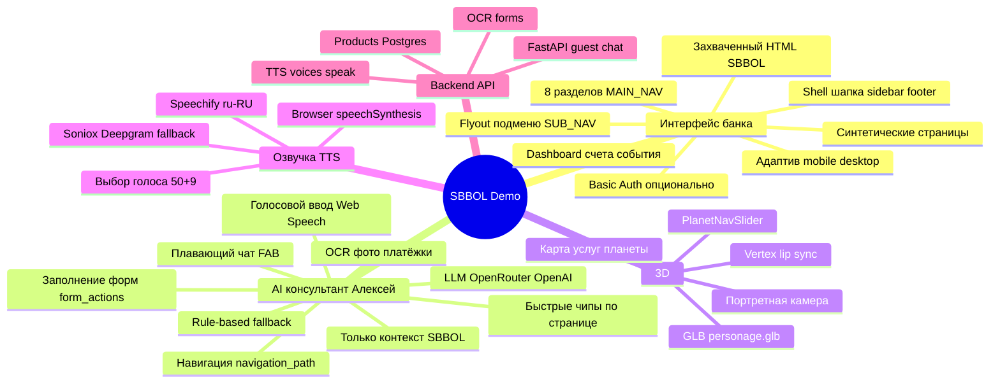

---

## 2. Карта фич по слоям

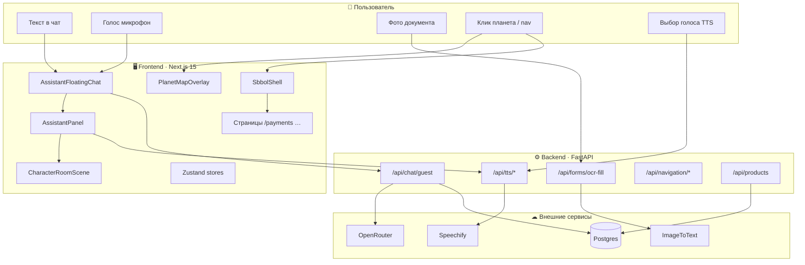

---

## 3. Матрица фич

| # | Фича | Где в UI | Backend / API | Статус |
|---|------|----------|---------------|--------|
| 1 | **Shell СберБизнес** | `SbbolShell` | — | ✅ |
| 2 | **Sidebar + flyout** | `MAIN_NAV`, `SUB_NAV` | — | ✅ |
| 3 | **Слайдер планет** | `PlanetNavSlider` | — | ✅ |
| 4 | **3D карта услуг** | `PlanetMapOverlay` | `planetMap.ts` | ✅ |
| 5 | **Hover только целевого объекта** | `PlanetLink` | — | ✅ |
| 6 | **Dashboard** | `/`, `DashboardHome` | — | ✅ |
| 7 | **Страницы разделов** | `/payments`, `/statement`, … | — | ✅ |
| 8 | **Формы платежей** | `paydocbyn`, `paydoccur`, `instant` | `form_actions` | ✅ |
| 9 | **AI-чат (guest)** | `AssistantFloatingChat` | `POST /api/chat/guest` | ✅ |
| 10 | **LLM + rules** | ответы ассистента | `assistant.py` | ✅ |
| 11 | **Навигация из чата** | `router.push` | `navigation_path` | ✅ |
| 12 | **Заполнение форм AI** | `useSbbolFormFill` | `form_actions` | ✅ |
| 13 | **OCR с фото** | `ChatInput` 📷 | `POST /api/forms/ocr-fill` | ✅ |
| 14 | **Голосовой ввод** | `useWebSpeechInput` | Web Speech API | ✅ |
| 15 | **3D Алексей** | `GlbCharacter3D` | — | ✅ |
| 16 | **Липсинг vertex** | `mouthVertexDeform` | — | ✅ |
| 17 | **Озвучка Speechify** | `useAssistantSpeech` | `POST /api/tts/speak` | ✅ |
| 18 | **Выбор голоса** | `AssistantVoicePicker` | `GET /api/tts/voices` | ✅ |
| 19 | **Каталог продуктов** | `ProductCard` | `GET /api/products` | ✅ |
| 20 | **Basic Auth** | `middleware.ts` | `SiteBasicAuthMiddleware` | ✅ |
| 21 | **JWT auth** | заготовка | `/api/auth/*` | 🔶 scaffold |
| 22 | **Деплой Vercel** | один домен | `api/index.py` | ✅ |
| 23 | **Обучающий модуль** | `/learning` → `LearningView` | `AI_COMMANDS` (12 категорий, ~130 команд) | ✅ |
| 24 | **Каталог команд ИИ** | вкладка «Команды ИИ» | `learningContent.ts::AI_COMMANDS` | ✅ |

---

## 4. Карта маршрутов (страницы)

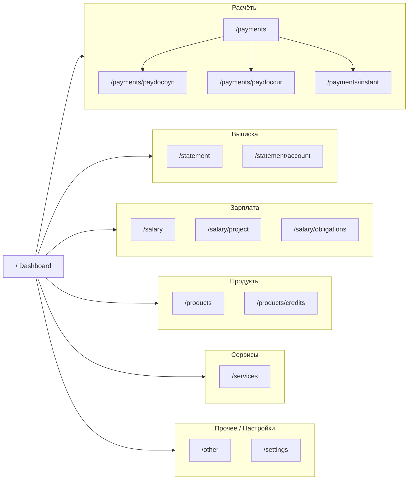

Полный список slug: `frontend/lib/sbbol/navigation.ts`, контент: `pageContent.ts` / `syntheticPageContent.ts`.

---

## 5. 3D-карта разделов (планеты)

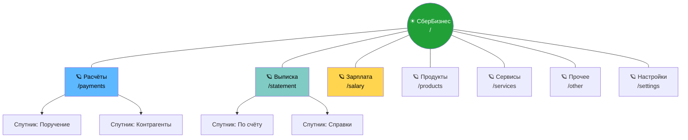

**Поведение:** клик → `router.push(url)` · hover → tooltip **только** у планеты или спутника под курсором · подсветка орбиты из `assistantStore.navigationPath`.

Источник данных: `frontend/lib/sber/planetMap.ts`.

---

## 6. AI-консультант: pipeline ответа

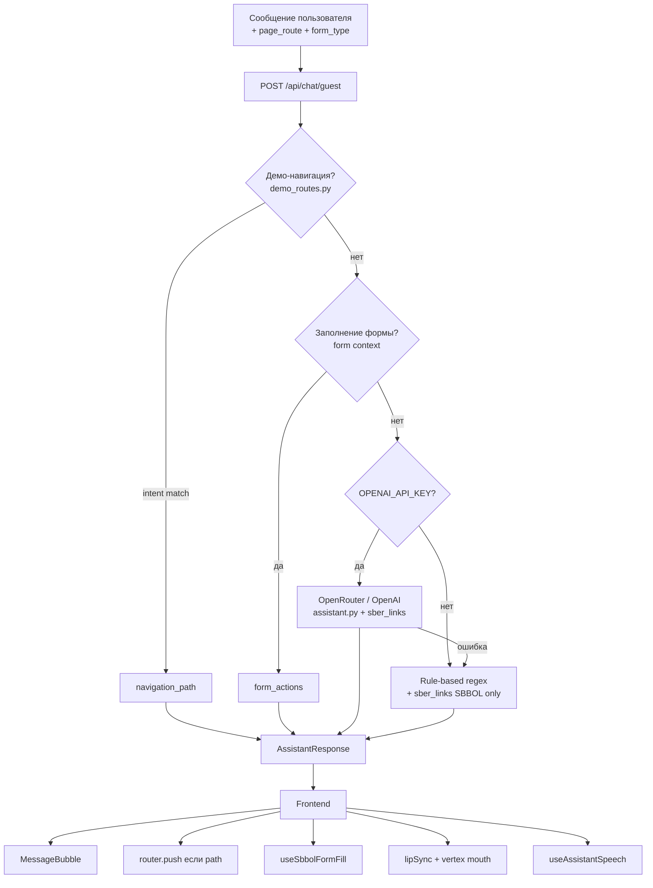

**Ограничение:** промпт и ссылки только **СберБизнес** — внутренние `/…`, не retail-сайт. См. [ASSISTANT.md](./ASSISTANT.md).

---

## 7. Сценарий: от вопроса до озвучки

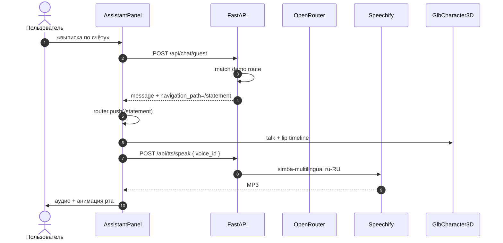

---

## 8. Мультимодальный ввод в чат

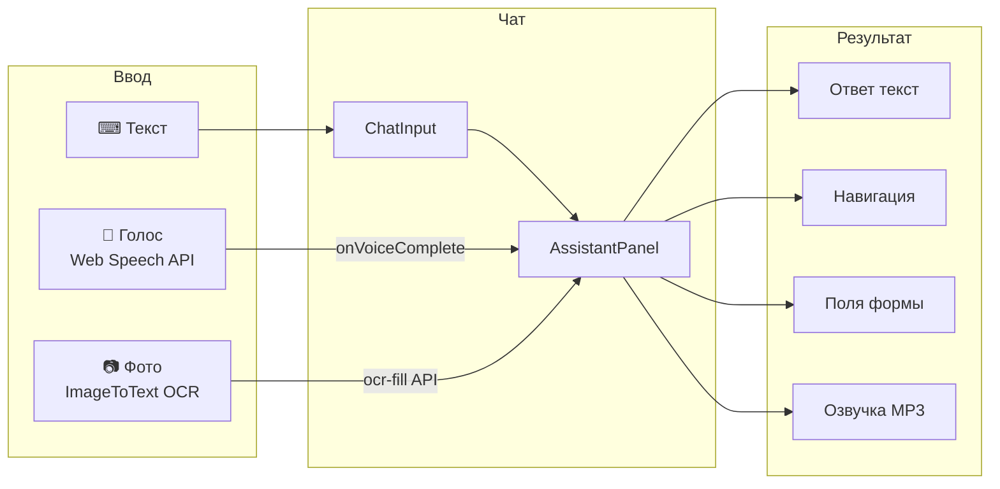

---

## 9. TTS: цепочка провайдеров

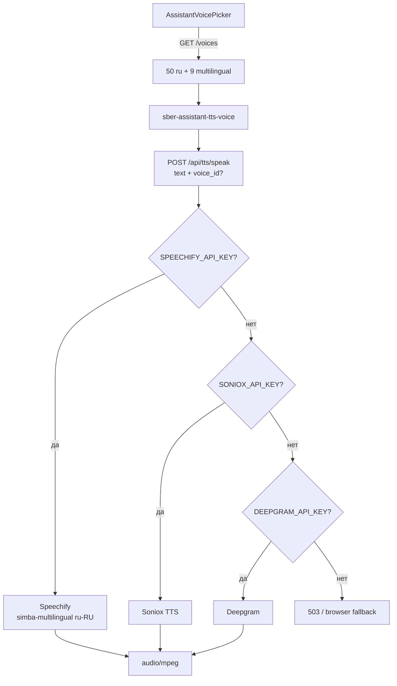

См. [TTS.md](./TTS.md).

---

## 10. 3D-консультант Алексей

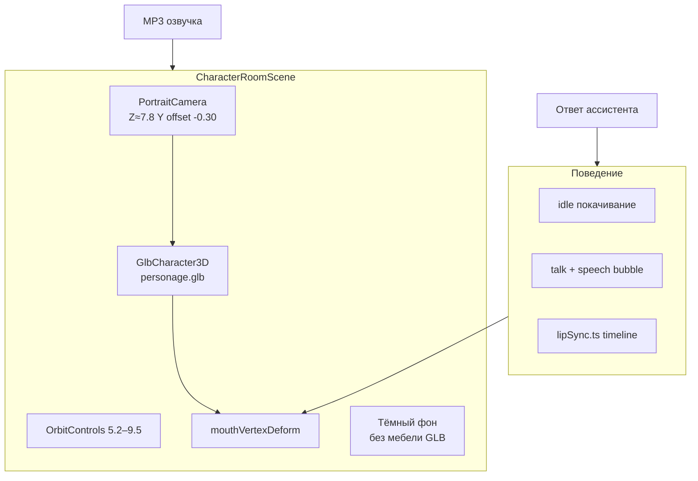

См. [CHARACTER_3D.md](./CHARACTER_3D.md).

---

## 11. Деплой и runtime

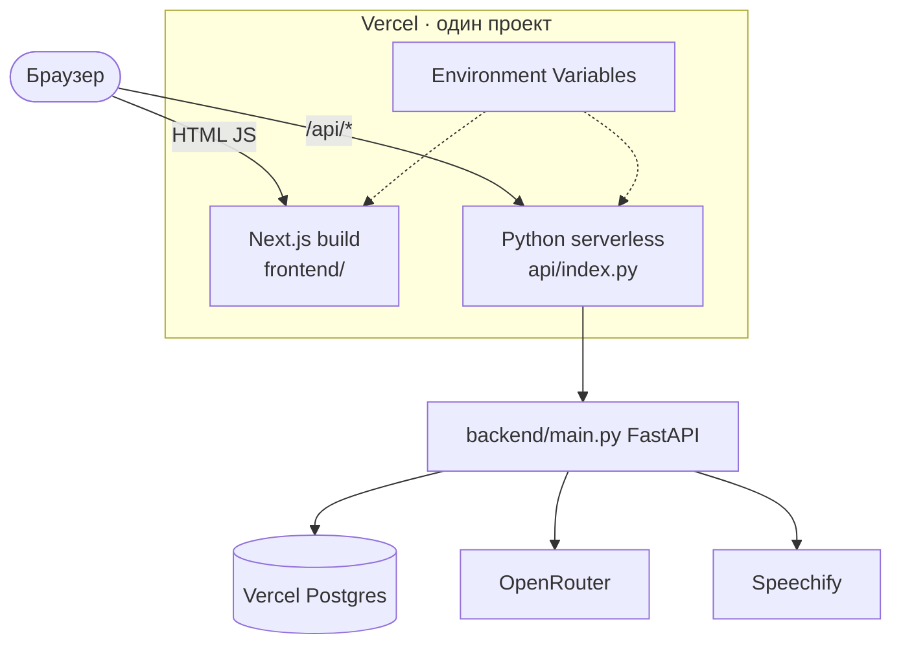

См. [VERCEL_DEPLOY.md](./VERCEL_DEPLOY.md).

---

## 12. Zustand stores (состояние UI)

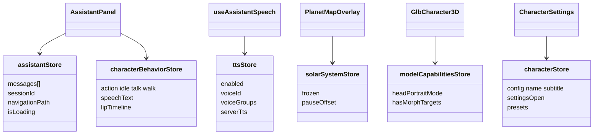

---

## 13. Зависимости документации

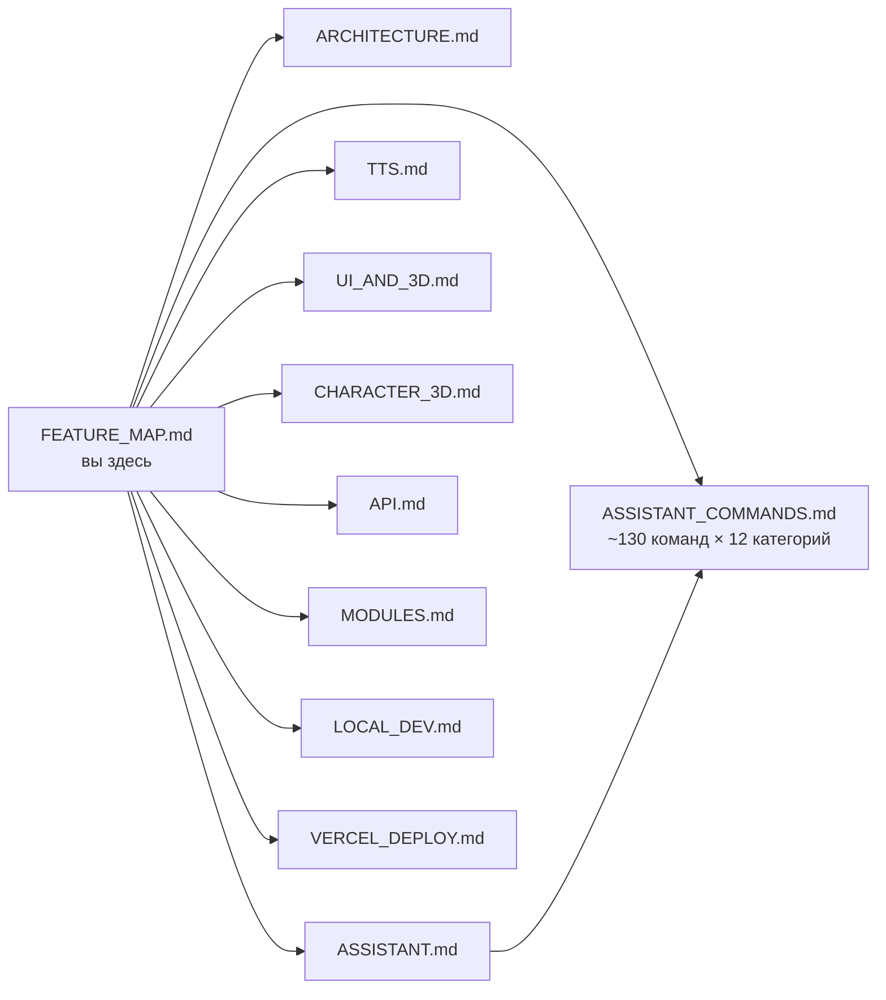

---

## 14. Быстрые сценарии для демо

| Сценарий | Действие | Ожидание |
|----------|----------|----------|
| Навигация | «выписка по счёту» | `/statement` |
| Форма | на `paydocbyn`: «сумма 500» | поле суммы |
| OCR | фото платёжки | поля формы |
| Голос | 🎤 → фраза | отправка в чат |
| TTS | ответ ассистента | MP3 + губы |
| Голос TTS | выпадающий список | Mikhail / George … |
| 3D карта | hover спутник | один tooltip |
| Планеты | клик «Расчёты» | `/payments` |
| Каталог ИИ | `/learning` → вкладка «Команды ИИ» | 12 категорий, ~130 запросов с фильтром и поиском |

---

## 15. Обучающий модуль и каталог команд ИИ

Страница `/learning` (`frontend/app/learning/page.tsx` → `components/learning/LearningView.tsx`) — это **встроенная документация по ИИ-консультанту** в UI.

```mermaid
flowchart LR
    LP[/learning] --> TAB1[Уроки<br/>LEARNING_MODULES]
    LP --> TAB2[Команды ИИ<br/>AI_COMMANDS]

    TAB1 --> M1[Первые шаги]
    TAB1 --> M2[ИИ-консультант]
    TAB1 --> M3[Графики и аналитика]
    TAB1 --> M4[Заполнение форм]
    TAB1 --> M5[Поиск и документы]
    TAB1 --> M6[Интеграция с 1С]
    TAB1 --> M7[Сервисы и продукты]
    TAB1 --> M8[Кнопки и действия]
    TAB1 --> M9[База знаний и налоги]
    TAB1 --> M10[Напоминания]
    TAB1 --> M11[Платежи / Выписка / Зарплата / Безопасность]

    TAB2 --> C1[Платежи]
    TAB2 --> C2[Документы]
    TAB2 --> C3[Графики]
    TAB2 --> C4[Аналитика]
    TAB2 --> C5[Навигация]
    TAB2 --> C6[Сервисы]
    TAB2 --> C7[Формы]
    TAB2 --> C8[1С]
    TAB2 --> C9[Напоминания]
    TAB2 --> C10[Кнопки]
    TAB2 --> C11[Продукты]
    TAB2 --> C12[Страхование]
```

**12 категорий × ~10 команд = ~130 рабочих запросов на естественном языке**, каждая с:
- краткой формулировкой (`cmd`)
- конкретным примером, который можно скопировать в чат (`example`)
- описанием что делает (`description`)
- фильтром по категории и поиском по подстроке
- кнопкой «Спросить ИИ» — отправляет пример в чат одной кнопкой

**Кнопка «Спросить»** использует `setSuggestedChips([question])` + `openChat()` из `useSbbolUi` — открывает чат с готовым сообщением.

**Прогресс** прохождения уроков сохраняется в `localStorage` (`sbbol_learning_progress`).

Полный реестр команд с backend-маппингом — [ASSISTANT_COMMANDS.md](./ASSISTANT_COMMANDS.md).

---

## Связанные файлы

| Область | Ключевые пути |
|---------|----------------|
| Shell | `components/layout/SbbolShell.tsx` |
| Чат | `components/assistant/*` |
| 3D карта | `components/three/PlanetLink.tsx` |
| AI | `backend/services/ai/assistant.py` |
| Навигация | `backend/services/navigation/demo_routes.py` |
| TTS | `backend/services/tts/` |
| Планеты | `frontend/lib/sber/planetMap.ts` |

Полное оглавление: [README.md](./README.md).
