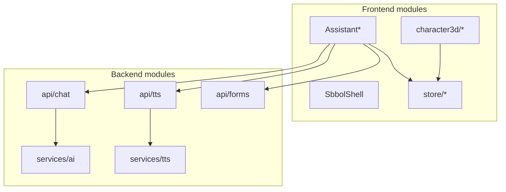

# Модули

> Карта фич и связи модулей: [FEATURE_MAP.md](./FEATURE_MAP.md) (§2, §12)

## Frontend

  Модуль   Файлы   Задача  
 -------- ------- -------- 
  Shell   `SbbolShell`, `SbbolAppLayout`   Layout, nav  
  SBBOL pages   `CapturedSbbolPage`, `SbbolRoutePage`, `PaymentFormPageContent`   Страницы демо  
  AI Chat   `AssistantFloatingChat`, `AssistantPanel`, `ChatInput`   Чат, микрофон, OCR  
  TTS UI   `AssistantVoicePicker`, `useAssistantSpeech`, `ttsStore`   Озвучка и выбор голоса  
  3D Character   `CharacterRoomScene`, `GlbCharacter3D`, `mouthVertexDeform`   Консультант Александр/Александра  
  Form AI   `useSbbolFormFill`, `assistantQuickChips`   Заполнение форм  
  Character settings   `CharacterSettings`, `characterStore`   Имя, пресеты, голос  
  Icons / UI   `SbbolIcons`, `globals.css`   Иконки header, токены SBBOL  

## Backend

  Модуль   Файлы   Задача  
 -------- ------- -------- 
  Chat   `api/chat.py`, `services/ai/assistant.py`   LLM + rules + SBBOL  
  Navigation   `services/navigation/demo_routes.py`, `navigation_service.py`   Демо-маршруты  
  Links   `services/sber_links.py`   Промпт и ссылки только SBBOL  
  TTS   `api/tts.py`, `services/tts/*`   Qwen (Alibaba) + Edge TTS fallback  
  Forms   `api/forms.py`, `services/ocr/`   OCR платёжек  
  Products   `api/products.py`, `db/seed.py`   Каталог  
  Auth   `api/auth.py`, `core/site_auth.py`   JWT + Basic Auth  
  DB   `db/database.py`, `core/db_url.py`   Postgres  

## Интеграции

  Сервис   Env   Документ  
 -------- ----- ---------- 
  OpenRouter   `OPENAI_*`   [ASSISTANT.md](./ASSISTANT.md)  
  Qwen TTS   `QWEN_TTS_*`   [TTS.md](./TTS.md)  
  ImageToText   `IMAGETOTEXT_*`   [API.md](./API.md)  
  Vercel Postgres   `POSTGRES_URL`   [VERCEL_DEPLOY.md](./VERCEL_DEPLOY.md)  

## Диаграмма зависимостей модулей

См. [UI.md](./UI.md), [FILE_STRUCTURE.md](./FILE_STRUCTURE.md).
