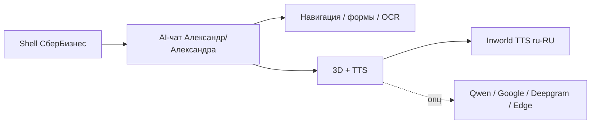

# Документация SBBOL Demo (MVP)

Демо **СберБизнес** с AI-консультантом **Александр / Александра** (3 GLB-модели, 3 пресета), озвучкой ответов и AI-заполнением платёжных форм.

**Начните здесь:** [FEATURE_MAP.md](./FEATURE_MAP.md) — карта фич с Mermaid-диаграммами.

| Документ | Содержание |
|----------|------------|
| **[FEATURE_MAP.md](./FEATURE_MAP.md)** | **Карта фич, mindmap, pipeline, матрица** |
| **[ASSISTANT_COMMANDS.md](./ASSISTANT_COMMANDS.md)** | **Полный каталог команд ИИ (~130 запросов × 12 категорий) с маппингом на бэкенд** |
| [../README.md](../README.md) | Обзор репозитория, быстрый старт |
| [LOCAL_DEV.md](./LOCAL_DEV.md) | Локальный запуск, проверка API и ИИ |
| [VERCEL_DEPLOY.md](./VERCEL_DEPLOY.md) | Деплой на Vercel (Next.js + FastAPI) |
| [ARCHITECTURE.md](./ARCHITECTURE.md) | Архитектура и потоки данных |
| [TECH_STACK.md](./TECH_STACK.md) | Стек и зависимости |
| [FILE_STRUCTURE.md](./FILE_STRUCTURE.md) | Дерево каталогов |
| **[PROJECT_MAP.md](./PROJECT_MAP.md)** | **Назначение каждой папки и каждого файла** |
| [MODULES.md](./MODULES.md) | Модули frontend / backend |
| [API.md](./API.md) | REST API (эндпоинты, примеры) |
| [ASSISTANT.md](./ASSISTANT.md) | AI: только SBBOL, навигация, формы |
| [WORKFLOW_DEMO.md](./WORKFLOW_DEMO.md) | 4 ключевых сценария приёмки демо |
| [TZ-assistant-p1.md](./TZ-assistant-p1.md) | ТЗ: приоритеты ИИ-помощника P1/P2 |
| [TTS.md](./TTS.md) | **Inworld TTS, state machine выбора голоса, все 7 провайдеров** |
| [UI.md](./UI.md) | UI, адаптив, чат |
| [CHARACTER_3D.md](./CHARACTER_3D.md) | 3D-консультант, камера, липсинг |

**Прод:** https://mvp-beta-umber.vercel.app  
**Референс UI:** https://sbbol.bps-sberbank.by/  
**Репозиторий:** https://github.com/grrraaaa/mvp

---

## Что умеет демо (кратко)



| Блок | Фичи |
|------|------|
| **UI** | Shell, sidebar, 19+ маршрутов, captured HTML |
| **AI** | LLM / rules, SBBOL-only, `navigation_path`, `form_actions` |
| **Ввод** | текст, голос, фото OCR |
| **3D** | GLB-консультант, vertex lip sync |
| **TTS** | **Inworld AI** (4 голоса, primary) + Qwen / Google / Deepgram / Edge / gTTS (опц.), ручной выбор в UI |

Подробная матрица и диаграммы → [FEATURE_MAP.md](./FEATURE_MAP.md).

---

## Переменные окружения

См. [../.env.example](../.env.example).

| Группа | Ключи |
|--------|-------|
| LLM | `OPENAI_API_KEY`, `OPENAI_BASE_URL`, `OPENAI_MODEL` |
| TTS (primary) | `INWORLD_API_KEY`, `INWORLD_VOICE_MALE`, `INWORLD_VOICE_FEMALE` |
| TTS (опц.) | `GOOGLE_TTS_API_KEY`, `QWEN_TTS_API_KEY`, `DEEPGRAM_API_KEY`, `EDGE_TTS_VOICE` |
| OCR | `IMAGETOTEXT_API_KEY`, `IMAGETOTEXT_API_SECRET` |
| БД | `DATABASE_URL` / `POSTGRES_URL` |
| Фронт | `NEXT_PUBLIC_API_URL`, `NEXT_PUBLIC_CHARACTER_*` |
| Безопасность | `SITE_ACCESS_USER`, `SITE_ACCESS_PASSWORD` |

> Полный список и state machine TTS — в [TTS.md](./TTS.md).

Локально: `NEXT_PUBLIC_API_URL=http://127.0.0.1:8000`.  
На Vercel: `NEXT_PUBLIC_API_URL` **пустой** (same-origin `/api`).

---

## Команды

```powershell
# Backend
cd mvp\backend
pip install -r requirements.txt
python -m uvicorn main:app --reload --host 127.0.0.1 --port 8000

# Frontend
cd mvp\frontend
npm install
npm run dev

# Деплой
cd mvp && vercel --prod
```

---

## Быстрая проверка

```powershell
Invoke-RestMethod http://127.0.0.1:8000/api/health
Invoke-RestMethod http://127.0.0.1:8000/api/tts/status
```

В браузере: http://localhost:3000 → AI-чат → «выписка по счёту» → `/statement`.

Сценарии демо: [FEATURE_MAP.md §14](./FEATURE_MAP.md#14-быстрые-сценарии-для-демо).
