# TTS — Text-to-Speech ассистента

> Озвучка ответов AI-консультанта (Александр / Александра). Один из 4-х голосов Inworld по умолчанию, ручной выбор сохраняется в `localStorage`.

---

## 1. Что реально работает сейчас

| # | Провайдер | Где живёт | Статус | Голоса | Цена / ключ |
|---|-----------|-----------|--------|--------|-------------|
| 1 | **Inworld AI** (server, NDJSON stream) | `backend/services/tts/inworld_tts.py` | **🟢 primary, задействован в роутере** | 4 (2 м × 2 слота) | `INWORLD_API_KEY` (Basic …) |
| 2 | **Google Cloud TTS** | `backend/services/tts/google_tts.py` | 🟡 код есть, в роутер **не подключён** | 10 (Neural2/Wavenet/Standard) | `GOOGLE_TTS_API_KEY` или Service Account |
| 3 | **Qwen / CosyVoice** (Alibaba) | `backend/services/tts/qwen_voices.py` | 🟡 каталог есть, в роутер **не подключён** | 7 (Qwen + CosyVoice) | `QWEN_TTS_API_KEY` |
| 4 | **Deepgram Aura-2** | `backend/services/tts/deepgram.py` | 🟡 код есть, в роутер **не подключён** | 4 (EN) | `DEEPGRAM_API_KEY` |
| 5 | **Microsoft Edge TTS** (`edge-tts`) | `backend/services/tts/edge_tts.py` | 🟡 код есть, в роутер **не подключён** | 2 (ru-RU Neural) | **бесплатно, без ключа** |
| 6 | **gTTS** (Google Translate) | `backend/services/tts/gtts_tts.py` | 🟡 код есть, в роутер **не подключён** | 1 (ж) + Edge (м) | **бесплатно, без ключа** |
| 7 | **Puter.js TTS** (browser) | `frontend/lib/tts/puterTts.ts` | 🟢 fallback в браузере, без бэка | 5 языков | бесплатно |

> **Правда про «всегда один голос».** Сейчас `voice_router.py` отдаёт только Inworld (`configured_providers()` → `["inworld"]` если задан ключ, иначе `[]`). Остальные 6 файлов лежат мёртвым грузом — у каждого свой `synthesize_speech()`, но ни один не вызывается из роутера. Чтобы открыть юзеру 20+ голосов, надо переписать `resolve_synthesis_route()` (см. [§6 Roadmap](#6-roadmap)).

---

## 2. State machine выбора голоса (фронт)

Активный голос управляется связкой `useTtsStore` (Zustand) + `useCharacterStore`. Полный цикл:

```mermaid
stateDiagram-v2
    direction LR
    [*] --> Unconfigured

    Unconfigured: ⬜ Unconfigured<br/>Inworld key не задан<br/>каталог пуст
    Loading: ⏳ Loading<br/>GET /status + /voices
    Bootstrapped: 🟢 Bootstrapped<br/>каталог загружен
    AutoPick: 🎯 Auto-pick<br/>голос по полу модели
    ManualPick: ✋ Manual pick<br/>юзер выбрал вручную
    Resyncing: 🔄 Resyncing<br/>сменился пол персонажа
    Speaking: 🔊 Speaking<br/>POST /speak → MP3
    Error: ❌ Error<br/>провайдер ответил 5xx

    Unconfigured --> Loading: TtsBootstrap mount
    Loading --> Bootstrapped: 200 OK + voices[]
    Loading --> Unconfigured: fetch failed<br/>(silent fallback)
    Bootstrapped --> AutoPick: voiceOverride пуст
    Bootstrapped --> ManualPick: voiceOverride задан
    AutoPick --> ManualPick: клик в VoicePicker
    ManualPick --> AutoPick: сброс voiceOverride
    AutoPick --> Resyncing: сменился стиль<br/>(human-m ↔ human-f)
    Resyncing --> AutoPick: новый голос подобран
    Resyncing --> ManualPick: override переехал на новый пол
    ManualPick --> Speaking: ассистент отвечает
    AutoPick --> Speaking: ассистент отвечает
    Speaking --> Bootstrapped: 200 OK (mp3)
    Speaking --> Error: 5xx / network
    Error --> Bootstrapped: ретрай / смена голоса
    Error --> Unconfigured: key отозван

    classDef ok fill:#dcfce7,stroke:#16a34a,color:#064e3b
    classDef warn fill:#fef3c7,stroke:#d97706,color:#78350f
    classDef bad fill:#fee2e2,stroke:#dc2626,color:#7f1d1d
    classDef info fill:#dbeafe,stroke:#2563eb,color:#1e3a8a

    class Bootstrapped,AutoPick ok
    class Loading,Resyncing,Speaking info
    class ManualPick warn
    class Unconfigured,Error bad
```



### 2.1. Где живёт каждый переход

| Переход | Триггер | Файл / функция |
|---------|---------|----------------|
| `* → Loading` | Маунт `<TtsBootstrap/>` | `frontend/components/assistant/TtsBootstrap.tsx` → `useTtsBootstrap()` |
| `Loading → Bootstrapped` | `fetchTtsVoices()` 200 | `frontend/hooks/useTtsBootstrap.ts:74-78` |
| `Loading → Unconfigured` | `fetch` упал | `useTtsBootstrap.ts:80-85` (silent fallback на `COMBINED_DEFAULT_VOICE`) |
| `Bootstrapped → AutoPick` | `voiceOverride` пуст + `voiceId` совпадает с полом | `useTtsBootstrap.ts:78` → `syncVoiceToCurrentCharacter()` |
| `Bootstrapped → ManualPick` | `localStorage[sber-assistant-tts-voice]` ∈ каталогу | `store/ttsStore.ts:104-117` (`setVoiceGroups`) |
| `AutoPick → ManualPick` | Клик в `<VoicePicker>` | `components/assistant/VoicePicker.tsx:50-53` (`handleSelect`) |
| `ManualPick → AutoPick` | `setVoiceOverride(null)` или `resetCharacter()` | `store/characterStore.ts` + `PersonalizationMenu.tsx:95` |
| `AutoPick → Resyncing` | Сменился `styleId` (human-m ↔ human-f) | `characterStore` subscriber |
| `Resyncing → AutoPick` | `pickVoiceForCharacter()` вернул ID | `lib/tts/matchVoiceForCharacter.ts` + `useTtsBootstrap.ts:41-44` |
| `* → Speaking` | `POST /api/tts/speak` | `lib/tts/playback.ts` |
| `Speaking → Error` | 5xx / abort / network | `lib/tts/playback.ts` error handler |
| `Error → Bootstrapped` | Юзер переключил голос / retry | `useTtsBootstrap` refetch |

### 2.2. Контракт «кто кого перебивает»

```
voiceOverride (characterStore)
    │
    ├── set + ∈ voices[]  →  юзерский выбор ЗАЩИЩЁН от автоподбора
    │                        (сохраняется при смене пола персонажа,
    │                         но `pickVoiceForGenderPreservingSlot`
    │                         подбирает новый ID того же слота 1/2)
    │
    └── null / ""          →  автоподбор: голос следует за полом модели
```

Главное: `voiceOverride` **не равно** `voiceId`. `voiceId` — текущий выбранный (всегда непустой после bootstrap), `voiceOverride` — маркер «юзер трогал руками».

---

## 3. Backend — что отдаёт API

```
GET /api/tts/status        → enabled, providers[], model, voice, voice_selection
GET /api/tts/voices        → groups[{id,label,voices[{id,name,short,gender,locale,tier,description}]}]
POST /api/tts/speak         → audio/mpeg (MP3)
                              body: {text, voice_id?}
```

### 3.1. Текущая сигнатура `/api/tts/voices`

```jsonc
// сейчас — только Inworld (4 голоса)
{
  "default_voice": "Nikolai",
  "model": "inworld-tts-2",
  "language": "auto",
  "providers": ["inworld"],
  "groups": [
    {
      "id": "inworld",
      "label": "Голос",
      "voices": [
        {"id": "Nikolai", "name": "Голос 1", "short": "Голос 1", "gender": "male",   "tier": "inworld", ...},
        {"id": "merry-candle-6309__design-voice-4147f476", "name": "Голос 2", "gender": "male", ...},
        {"id": "Svetlana",  "name": "Голос 1", "gender": "female", ...},
        {"id": "Elena",     "name": "Голос 2", "gender": "female", ...}
      ]
    }
  ]
}
```

### 3.2. Endpoint speak

```python
# backend/api/tts.py:69
@router.post("/speak")
async def speak(request: SpeakRequest):
    cleaned = clean_text_for_tts(request.text)
    if not cleaned:
        raise HTTPException(400, "Нет текста для озвучки")
    try:
        voice_id = (request.voice_id or "").strip() or None
        audio = await synthesize_speech(cleaned, voice_id=voice_id)
    except TtsNotConfiguredError as exc:    # → 503
        raise HTTPException(503, str(exc))
    except TtsProviderError as exc:         # → 502 / passthrough
        status = exc.status_code if 400 <= exc.status_code < 600 else 502
        raise HTTPException(status, str(exc))
    return Response(content=audio, media_type="audio/mpeg",
                    headers={"Cache-Control": "no-store"})
```

`synthesize_speech()` в `backend/services/tts/__init__.py:33`:
- `provider=="inworld"` → стримит NDJSON из Inworld, склеивает MP3
- всё остальное → `raise TtsNotConfiguredError` (поэтому юзер видит «API key required» баннер для Google/Qwen)

---

## 4. Голосовые каталоги — что в каждом файле

| Файл | Сколько голосов | Слот / tier | Как резолвится |
|------|----------------|-------------|----------------|
| `inworld_voices.py` | 4 | slot 1/2 (по полу) | `INWORLD_VOICE_MALE` / `INWORLD_VOICE_FEMALE` env |
| `google_voices.py` | 10 (4 Neural2 + 4 Wavenet + 2 Standard) | `tier=neural2/wavenet/standard`, цепочка fallback `google_voice_chain()` | `GOOGLE_TTS_VOICE` env, иначе `Wavenet-B` |
| `qwen_voices.py` | 7 (2 Qwen + 5 CosyVoice) | `tier=qwen/cosyvoice`, мультиголос для одного tier | `QWEN_TTS_VOICE` env, иначе `qwen-male` |
| `deepgram_voices.py` | 4 (EN Aura-2) | `tier=deepgram` | `DEEPGRAM_TTS_VOICE` env, иначе `arcas` |
| `edge_voices.py` | 2 (ru-RU Neural) | — | `EDGE_TTS_VOICE` env, иначе `DmitryNeural` |
| `gtts_voices.py` | 1 (`ru-male` через Edge) | — | `GTTS_VOICE` env |
| `puter_voices.ts` (FE) | 5 языков | — | client-side only |

### 4.1. Синхронизация фронт ↔ бэк

Статические копии каталогов лежат в `frontend/lib/tts/`. Они нужны как **fallback на cold start**, до того как `/api/tts/voices` ответит:

- `lib/tts/assistantVoices.ts` — Inworld 4 голоса
- `lib/tts/googleVoices.ts` — Google 10 голосов
- `lib/tts/qwenVoices.ts` — Qwen 7 голосов
- `lib/tts/deepgramVoices.ts` — Deepgram 4 голоса
- `lib/tts/edgeVoices.ts` — Edge 2 голоса
- `lib/tts/gttsVoices.ts` — gTTS 1 голос
- `lib/tts/puterVoices.ts` — Puter 5 языков
- `lib/tts/combinedVoices.ts` — объединённый каталог для `COMBINED_VOICE_GROUPS` (используется при недоступном бэке)

> Любые изменения в `backend/services/tts/*_voices.py` нужно дублировать в `frontend/lib/tts/*Voices.ts` (для `voiceFallback` хука) — иначе на холодном старте юзер увидит устаревший список.

---

## 5. Frontend — UI компоненты

| Файл | Что делает |
|------|------------|
| `components/assistant/PersonalizationMenu.tsx` | Кебаб-меню «⋯» в шапке. Кнопка-превью + выбор голоса + выбор модели 3D |
| `components/assistant/VoicePicker.tsx` | Компактный список голосов с превью-кнопкой ▶, фильтрует по `characterGender` |
| `components/assistant/CharacterSettings.tsx` | Полная панель «Способности ИИ» с расширенным выбором голоса |
| `store/ttsStore.ts` | Zustand: `voiceId`, `voiceGroups`, persistence в `localStorage` |
| `store/characterStore.ts` | Zustand: `voiceOverride` (маркер ручного выбора), `modelOverride`, `config` |
| `hooks/useTtsBootstrap.ts` | Один раз при маунте: `fetchTtsStatus` + `fetchTtsVoices` + `syncVoiceToCurrentCharacter` |
| `lib/tts/playback.ts` | `stopTtsPlayback()`, очередь, прерывание |
| `lib/tts/previewVoice.ts` | Кнопка «Прослушать»: 5-сек превью фраза текущим голосом |
| `lib/tts/matchVoiceForCharacter.ts` | `pickVoiceForCharacter(groups, styleId, currentVoiceId)` — slot-preserving |
| `lib/tts/cleanTextForTts.ts` | Чистит markdown/URL перед отправкой на `/speak` |

### 5.1. Что юзер видит сейчас

`PersonalizationMenu` показывает 4 голоса Inworld (2 мужских + 2 женских), отфильтрованных по полу активной 3D-модели. Кнопка ▶ — превью 5-сек фразы «Привет, я ваш персональный ассистент СберБизнес». Клик по строке = мгновенный выбор.

---

## 6. Roadmap

Чтобы открыть юзеру 20+ голосов и реально дать выбор, нужно:

### 6.1. Переписать `voice_router.py`

```python
# текущее (90 строк, только Inworld)
def resolve_synthesis_route(voice_id):
    if is_inworld_voice(voice_id):   return ("inworld", voice_id)
    if _inworld_configured():         return ("inworld", default)
    return ("inworld", voice_id)       # ← фоллбек на любой мусор

# целевое (псевдокод)
PROVIDER_BY_PREFIX = {
    "ru-RU-":           "google",    # все ru-RU-* идут в Google
    "qwen-":            "qwen",      # Qwen/CosyVoice
    "aura-2-":          "deepgram",  # Aura модели
    "ru-RU-Dmitry":     "edge",      # Edge
    "ru-RU-Svetlana":   "edge",
    "Nikolai":          "inworld",
    "Svetlana":         "inworld",
    "merry-candle":     "inworld",
    "Elena":            "inworld",
}

def resolve_synthesis_route(voice_id):
    raw = (voice_id or "").strip()
    for prefix, provider in PROVIDER_BY_PREFIX.items():
        if raw.startswith(prefix):
            if not _provider_configured(provider):
                continue  # → следующий провайдер в fallback-цепочке
            return (provider, raw)
    return _first_configured_with_default()
```

### 6.2. Добавить `synthesize_speech` мультипровайдер

```python
# backend/services/tts/__init__.py
FALLBACK_CHAIN = ["inworld", "qwen", "google", "deepgram", "edge", "gtts"]

async def synthesize_speech(text, voice_id):
    route = resolve_synthesis_route(voice_id)
    for provider, resolved in _expand_with_fallbacks(route):
        try:
            return await _PROVIDERS[provider](text, resolved)
        except TtsNotConfiguredError:
            continue        # нет ключа — пробуем следующий
        except TtsProviderError as exc:
            if exc.status_code in (401, 403, 429):  # квота/ключ
                continue
            raise           # другая ошибка — наверх
    raise TtsNotConfiguredError("Ни один TTS-провайдер не сконфигурирован")
```

### 6.3. Прокинуть каталоги в `list_all_assistant_voices()`

```python
def list_all_assistant_voices():
    groups = []
    if _inworld_configured():    groups.append(_catalog("inworld",    inworld_voice_entries(),   "Inworld AI"))
    if _google_tts_configured(): groups.append(_catalog("google",     google.list_assistant_voices()["groups"][0]["voices"], "Google Cloud TTS"))
    if _qwen_configured():       groups.append(_catalog("qwen",       qwen.list_assistant_voices()["groups"][0]["voices"],   "Qwen / CosyVoice"))
    if settings.DEEPGRAM_API_KEY:groups.append(_catalog("deepgram",   deepgram.list_assistant_voices()["groups"][0]["voices"],"Deepgram Aura-2"))
    if _edge_available():        groups.append(_catalog("edge",       edge.list_assistant_voices()["groups"][0]["voices"],    "Microsoft Edge (бесплатно)"))
    if _gtts_available():        groups.append(_catalog("gtts",       gtts.list_assistant_voices()["groups"][0]["voices"],    "Google Translate (бесплатно)"))
    return {"default_voice": ..., "model": "multi", "groups": groups, ...}
```

### 6.4. UX-фишки (отложено)

- [ ] Бейджи качества (Premium / HD / Базовый) — каркас уже в `google_voices.py` (`tier=neural2/wavenet/standard`)
- [ ] Сортировка по `tier` в `<VoicePicker>` (премиум сверху)
- [ ] Реальные превью-аудио (5-сек сэмплы) вместо синтеза «на лету»
- [ ] Сохранение `voiceOverride` на бэке (в `users.voice_id`) — переживает смену браузера
- [ ] Кнопка «Вернуть автоподбор» в `<PersonalizationMenu>`

---

## 7. ENV — что задавать

Обязательно для работы TTS:
```env
INWORLD_API_KEY=Basic <base64>     # единственный активный провайдер
INWORLD_VOICE_MALE=Nikolai
INWORLD_VOICE_FEMALE=Svetlana
INWORLD_MODEL_ID=inworld-tts-2
```

Опционально (откроются доп. голоса после [§6](#6-roadmap)):
```env
GOOGLE_TTS_API_KEY=AIza...                  # 10 голосов Neural2/Wavenet/Standard
QWEN_TTS_API_KEY=sk-ws-...                  # 7 голосов Qwen + CosyVoice
QWEN_TTS_BASE_URL=https://ws-XXXX.eu-central-1.maas.aliyuncs.com/api/v1
QWEN_TTS_MODEL=qwen3-tts-flash,cosyvoice-v3-flash
DEEPGRAM_API_KEY=...                        # 4 голоса Aura-2 (EN)
EDGE_TTS_VOICE=ru-RU-DmitryNeural           # Edge (бесплатно, без ключа)
```

В Vercel: добавить в **Environment Variables** той же секции, где `POSTGRES_URL`.

---

## 8. Тесты

```bash
cd backend
pytest tests/test_voice_router.py -v      # 5 тестов на роутер
pytest tests/test_assistant_parsers.py -v  # парсеры текста
```

Текущее покрытие `voice_router`:
- `configured_providers()` — пустой / с ключом
- `resolve_synthesis_route(voice_id)` — Inworld / fallback / unknown
- `list_all_assistant_voices()` — структура payload
- `tts_status_payload()` — статус для `/api/tts/status`

После расширения [§6](#6-roadmap) добавить:
- [ ] `test_voice_router_multiprovider` — fallback по цепочке
- [ ] `test_google_fallback_chain` — Neural2 → Wavenet → Standard
- [ ] `test_qwen_tier_resolution` — Qwen vs CosyVoice routing

---

## 9. Полезные ссылки

- [ARCHITECTURE.md](./ARCHITECTURE.md) — где TTS живёт в общей архитектуре
- [API.md](./API.md) — полная спецификация `/api/tts/*`
- [FILE_STRUCTURE.md](./FILE_STRUCTURE.md) — где какие файлы
- [MODULES.md](./MODULES.md) — модули фронта/бэка
- [VERCEL_DEPLOY.md](./VERCEL_DEPLOY.md) — как заливать ключи на Vercel
